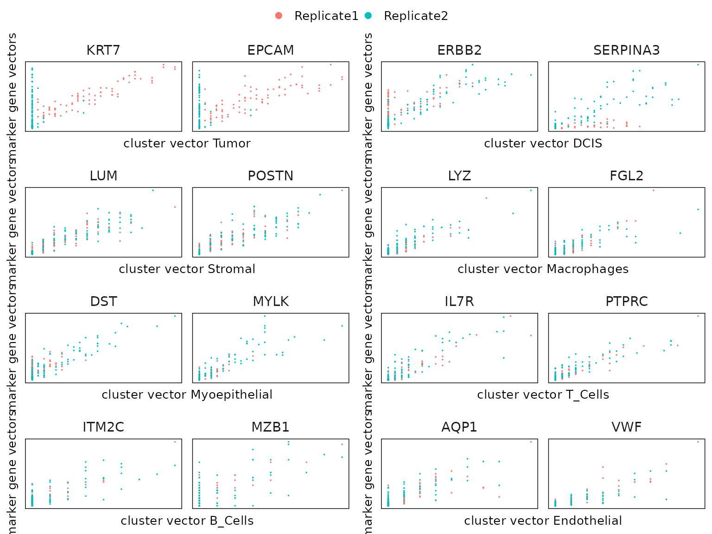

# jazzPanda example

## Introduction

Spatial transcriptomics allows the spatial profiling of complex tissue
architectures. The spatial arrangement and interactions between cells
can aid in understanding of complex functions and regulatory mechanisms
in various tissue micro environments. Commercially available image-based
spatial technologies such as Xenium, CosMX, and MERSCOPSE take advantage
of fluorescence-based microscopy to quantify transcripts and focus on a
pre-designed panel of genes.

One crucial step in the analysis of spatial transcriptomics data is cell
type annotation. There are a number of ways to perform cell type
annotation, and marker analysis is one of them. Marker gene analysis to
identify genes highly expressed in each cluster compared to the
remaining clusters. The identified marker genes are used to annotate
clusters with cell types. Computationally tools originally developed for
single cell data are used for spatial transcriptomics studies. However,
those methods ignore the spatial information for the cells and gene.
There is limited literature on developing marker gene detection methods
that account for the spatial distribution of gene expression. jazzPanda
provides two novel approaches to detect marker genes with transformed
spatial information. Our first approach is based on correlation and the
second linear modelling approach can account for technical noise and
work for studies with multiple samples.

## jazzPanda framework

We assume a marker gene will show a significant linear relationship with
the target cluster over the tissue space. This suggests that the
transcript detection of a marker gene will show similar patterns with
the cells from the cluster over tissue space. Given the cluster label of
every cell, there are two steps to obtain marker genes for every
cluster. We first compute spatial vectors from the spatial coordinates
of the genes and the clusters. After that, we can measure the linear
relationship between the genes and clusters based on spatial vectors. We
develop two approaches for detecting genes that show strong linear
relationship with the cluster.

- **Step 1:** *Create spatial vectors for every gene and every
  cluster*  
  [`get_vectors()`](https://phipsonlab.github.io/jazzPanda/reference/get_vectors.md)
  can be used to convert the transcript detection and the cell centroids
  to spatial vectors. You can specify the tile shape and length based on
  you dataset. The hex bins will generally take longer than the
  square/rectangle bins to compute. In practice, we find that we can
  choose the length tiles such that the average cell per tile
  ($\frac{\texttt{\#}{\mspace{6mu}\text{cells per cluster}}}{\texttt{\#}{\mspace{6mu}\text{tiles}}}$)
  is close to one for each cluster.

- **Step 2:** *Detect marker genes*

  - Correlation approach:
    [`compute_permp()`](https://phipsonlab.github.io/jazzPanda/reference/compute_permp.md)
    This approach can detect marker genes for one sample study. We
    calculate a correlation coefficient between every pair of gene and
    cluster vector. We perform permutation testing to assess the
    statistical significance of the calculated correlation and followed
    by multiple testing adjustment to control the false discovery rate.
    We keep the genes with significant adjusted p-value and large
    correlation as marker genes. In practice, we recommend to calculate
    a correlation threshold value for every cluster based on the data
    distribution. During our analysis, we use 75% quantile value of all
    correlations to the given cluster as the cutoff and manage to keep
    meaningful marker genes.

  - Linear modelling approach:
    [`lasso_markers()`](https://phipsonlab.github.io/jazzPanda/reference/lasso_markers.md)
    In this approach, we treat the gene vector as the response variable
    and the cluster vectors as the explanatory variables. We select the
    important cluster vectors by lasso regularization first, and fit a
    linear model to find the cluster that show minimum p-value and
    largest model coefficient. This approach can account for
    multi-sample studies and the technical background noise (such as the
    non-specific binding). We recommend to set a model coefficient
    cutoff value based on your data. A large cutoff value will result in
    fewer marker genes whereas a small cutoff value will detect more
    marker genes. We find a cutoff value at 0.1 or 0.2 work well for our
    analysis. Marker genes with less than 0.1 model coefficient are
    generally weak markers.  
    Two data frames will be returned from this approach:

    1.  We record the most significant cluster for each gene by calling
        the
        [`get_top_mg()`](https://phipsonlab.github.io/jazzPanda/reference/get_top_mg.md)
        function. This table provides unique marker genes for every
        cluster. Genes whose top cluster shows a model coefficient
        smaller than the specified cutoff value will not be labeled as
        marker genes.

    2.  We record all the significant cluster for each gene by using the
        function
        [`get_full_mg()`](https://phipsonlab.github.io/jazzPanda/reference/get_full_mg.md).
        This table can be used to investigate shared marker genes for
        different clusters.

## Example

The dataset used in this vignette is a selected subset from two
replicates of Xenium human breast cancer tissue Sample 1. We select 20
genes for package illustration. This subset was extracted from the raw
dataset as described in the R script located at
`system.file("script","generate_vignette_data.R", package="jazzPanda")`.

This subset data is used for package illustration purpose only. The
resulting marker genes may not be strong markers for annotating
clusters. Please see the full analysis for this dataset for marker
genes.

``` r
library(jazzPanda)
library(SpatialExperiment)
library(ggplot2)
library(grid)
library(data.table)
library(dplyr)
library(glmnet)
library(caret)
library(corrplot)
library(igraph)
library(ggraph)
library(ggrepel)
library(gridExtra)
library(utils)
library(spatstat)
library(tidyr)
library(ggpubr)
```

``` r
# ggplot style
defined_theme <- theme(strip.text = element_text(size = rel(1)),
                        strip.background = element_rect(fill = NA, 
                                                    colour = "black"),
                        axis.line=element_blank(),
                        axis.text.x=element_blank(),
                        axis.text.y=element_blank(),
                        axis.ticks=element_blank(),
                        axis.title.x=element_blank(),
                        axis.title.y=element_blank(),
                        legend.position="none",
                        panel.background=element_blank(),
                        panel.border=element_blank(),
                        panel.grid.major=element_blank(),
                        panel.grid.minor=element_blank(),
                        plot.background=element_blank())
```

### Load data

``` r
data(rep1_sub, rep1_clusters, rep1_neg)
rep1_clusters$cluster<-factor(rep1_clusters$cluster,
                            levels=paste("c",1:8, sep=""))
# record the transcript coordinates for rep1
rep1_transcripts <-BumpyMatrix::unsplitAsDataFrame(molecules(rep1_sub))
rep1_transcripts <- as.data.frame(rep1_transcripts)
colnames(rep1_transcripts) <- c("feature_name","cell_id","x","y")
# record the negative control transcript coordinates for rep1
rep1_nc_data <- BumpyMatrix::unsplitAsDataFrame(molecules(rep1_neg))
rep1_nc_data <- as.data.frame(rep1_nc_data)
colnames(rep1_nc_data) <- c("feature_name","cell_id","x","y","category")

# record all real genes in the data
all_real_genes <- unique(as.character(rep1_transcripts$feature_name))
all_celltypes <- unique(rep1_clusters[,c("anno","cluster")])
```

### Visualise the clusters over the tissue space

We can plot the cells coordinates for each cluster of Replicate 1 subset

``` r
p1<-ggplot(data = rep1_clusters,
        aes(x = x, y = y, color=cluster))+
        geom_point(position=position_jitterdodge(jitter.width=0,
                                        jitter.height=0), size=0.1)+
        scale_y_reverse()+
        theme_classic()+
        facet_wrap(~sample)+
        scale_color_manual(values = c("#FC8D62","#66C2A5" ,"#8DA0CB","#E78AC3",
                        "#A6D854","skyblue","purple3","#E5C498"))+
        guides(color=guide_legend(title="cluster", nrow = 2,
                        override.aes=list(alpha=1, size=2)))+
        
        theme(axis.text.x=element_blank(),
                axis.text.y=element_blank(),
                axis.ticks=element_blank(),
                panel.spacing = grid::unit(0.5, "lines"),
                axis.title.x=element_blank(),
                axis.title.y=element_blank(),
                legend.position="none",
                strip.text = element_text(size = rel(1)))+
        xlab("")+
        ylab("")
p2<-ggplot(data = rep1_clusters,
        aes(x = x, y = y, color=cluster))+
        geom_point(position=position_jitterdodge(jitter.width=0, 
                                    jitter.height=0), size=0.1)+
        facet_wrap(~cluster, nrow = 2)+
        scale_y_reverse()+
        theme_classic()+
        scale_color_manual(values = c("#FC8D62","#66C2A5" ,"#8DA0CB","#E78AC3",
                        "#A6D854","skyblue","purple3","#E5C498"))+
        guides(color=guide_legend(title="cluster", nrow = 1,
        override.aes=list(alpha=1, size=4)))+
        theme(axis.text.x=element_blank(),
            axis.text.y=element_blank(),
            axis.ticks=element_blank(),
            axis.title.x=element_blank(),
            axis.title.y=element_blank(),
            panel.spacing = grid::unit(0.5, "lines"), 
            legend.text = element_text(size=10),
            legend.position="none",
            legend.title = element_text(size=10),
            strip.text = element_text(size = rel(1)))+
        xlab("")+
        ylab("")

spacer <- patchwork::plot_spacer()
layout_design <- (p1 / spacer) | p2

layout_design <- layout_design + 
                    patchwork::plot_layout(widths = c(1, 4), heights = c(1, 1)) 

print(layout_design)
```


### Spatial vectors

We can visualize the spatial vectors for clusters and genes as follows.
As an example for creating spatial vectors for genes, we plot the
transcript detections for the gene EPCAM over tissue space, along with
the square and hex binning result. Similarly, we plot the cell
coordinates in cluster c1, as well as the square and hex bin values over
the space as an example. We can see that with the square and hex bins
capture the key patterns of the original coordinates. Hex bins can
capture more details than square bins.

#### Example of gene vectors from scratch

``` r
w_x <- c(min(floor(min(rep1_transcripts$x)),
        floor(min(rep1_clusters$x))), 
        max(ceiling(max(rep1_transcripts$x)),
        ceiling(max(rep1_clusters$x))))
w_y <- c(min(floor(min(rep1_transcripts$y)),
        floor(min(rep1_clusters$y))), 
        max(ceiling(max(rep1_transcripts$y)),
        ceiling(max(rep1_clusters$y))))

# plot transcript detection coordinates
selected_genes <- rep1_transcripts$feature_name == "EPCAM"
loc_mt <- as.data.frame(rep1_transcripts[selected_genes,
                        c("x","y","feature_name")]%>%distinct())
colnames(loc_mt)<-c("x","y","feature_name")
layout(matrix(c(1, 2, 3), 1, 3, byrow = TRUE))
par(mar=c(5,3,6,3))
plot(loc_mt$x, loc_mt$y, main = "", xlab = "", ylab = "", 
        pch = 20, col = "maroon4", cex = 0.1,xaxt='n', yaxt='n')   
title(main = "EPCAM transcript detection", line = 3)
box() 

# plot square binning 
curr<-loc_mt[loc_mt[,"feature_name"]=="EPCAM",c("x","y")] %>% distinct()
curr_ppp <- ppp(curr$x,curr$y,w_x, w_y)
vec_quadrat <- quadratcount(curr_ppp, 10,10)
vec_its <- intensity(vec_quadrat, image=TRUE)
par(mar=c(0.01,1, 1, 2))
plot(vec_its, main = "")
title(main = "square binning", line = -2)

# plot hex binning 
w <- owin(xrange=w_x, yrange=w_y)
H <- hextess(W=w, 20)
bin_length <- length(H$tiles)
curr<-loc_mt[loc_mt[,"feature_name"]=="EPCAM",c("x","y")] %>% distinct()
curr_ppp <- ppp(curr$x,curr$y,w_x, w_y)
vec_quadrat <- quadratcount(curr_ppp, tess=H)
vec_its <- intensity(vec_quadrat, image=TRUE)
par(mar=c(0.1,1, 1, 2))
plot(vec_its, main = "")
title(main = "hex binning", line = -2)
```


#### Example of cluster vectors from scratch

``` r
w_x <- c(min(floor(min(rep1_transcripts$x)),
            floor(min(rep1_clusters$x))), 
        max(ceiling(max(rep1_transcripts$x)),
            ceiling(max(rep1_clusters$x))))
w_y <-  c(min(floor(min(rep1_transcripts$y)),
            floor(min(rep1_clusters$y))), 
        max(ceiling(max(rep1_transcripts$y)),
            ceiling(max(rep1_clusters$y))))

# plot cell coordinates
loc_mt <- as.data.frame(rep1_clusters[rep1_clusters$cluster=="c1",
            c("x","y","cluster")])
colnames(loc_mt)=c("x","y","cluster")
layout(matrix(c(1, 2, 3), 1, 3, byrow = TRUE))
par(mar=c(5,3,6,3))
plot(loc_mt$x, loc_mt$y, main = "", xlab = "", ylab = "", 
        pch = 20, col = "maroon4", cex = 0.1,xaxt='n', yaxt='n')   
title(main = "cell coordinates in cluster c1", line = 3)
box() 

# plot square binning 
curr<-loc_mt[loc_mt[,"cluster"]=="c1", c("x","y")]%>%distinct()
curr_ppp <- ppp(curr$x,curr$y,w_x, w_y)
vec_quadrat <- quadratcount(curr_ppp, 10,10)
vec_its <- intensity(vec_quadrat, image=TRUE)
par(mar=c(0.1,1, 1, 2))
plot(vec_its, main = "")
title(main = "square binning", line = -2)

# plot hex binning 
w <- owin(xrange=w_x, yrange=w_y)
H <- hextess(W=w, 20)
bin_length <- length(H$tiles)
curr<-loc_mt[loc_mt[,"cluster"]=="c1",c("x","y")] %>%distinct()
curr_ppp <- ppp(curr$x,curr$y,w_x, w_y)
vec_quadrat <- quadratcount(curr_ppp, tess=H)
vec_its <- intensity(vec_quadrat, image=TRUE)
par(mar=c(0.1,1, 1, 2))
plot(vec_its, main = "")
title(main = "hex binning", line = -2)
```


The function
[`get_vectors()`](https://phipsonlab.github.io/jazzPanda/reference/get_vectors.md)
can be used to create spatial vectors for all the genes and clusters.
These spatial vectors may take the form of squares, rectangles, or
hexagons specified by the `bin_type` parameter. \### Create spatial
vectors for all genes and clusters

``` r
seed_number<- 589

grid_length <- 10
# get spatial vectors
rep1_sq10_vectors <- get_vectors(x= rep1_sub,
                                sample_names = "rep1",
                                cluster_info = rep1_clusters,
                                bin_type="square",
                                bin_param=c(grid_length,grid_length), 
                                test_genes = all_real_genes)
```

The fucntion `get_vector()` now automatically detects the bounding box
to define spatial vectors. This makes it robust to scenarios where
different samples have very different spatial extents (e.g., one sample
is much larger than another).

If you want to define gene vectors from transcript coordinates, the cell
and transcript coordinates must be in the same coordinate frame and
scale (same units, same origin). If they aren’t, transform/rescale one
to match the other before calling `get_vector()`

``` r
seed_number<- 589
grid_length <- 10

# get spatial vectors for clusters only
cluster_sq10_vectors <- get_vectors(x= NULL,
                                sample_names = "rep1",
                                cluster_info = rep1_clusters,
                                bin_type="square",
                                bin_param=c(grid_length,grid_length), 
                                test_genes = all_real_genes)
# the gene vectors can be accessed as:
head(cluster_sq10_vectors$cluster_mt) 
```

    ##      c5 c8 c3 c2 c1 c4 c6 c7
    ## [1,]  0  2  1  0  7  1  0  1
    ## [2,]  0  1  1  0  6  0  0  0
    ## [3,]  0  0  3  0 13  1  0  0
    ## [4,]  0  0  4  0  2  3  2  1
    ## [5,]  0  0  1  0  0  7  9  2
    ## [6,]  0  0  3  0  0  3  3  2

``` r
# cluster_sq10_vectors$cluster_mt is equivalent to rep1_sq10_vectors$cluster_mt

#######################################################
# get spatial vectors for genes only 
gene_sq10_vectors <- get_vectors(x= rep1_sub,
                                sample_names = "rep1",
                                cluster_info = NULL,
                                bin_type="square",
                                bin_param=c(grid_length,grid_length), 
                                test_genes = all_real_genes)
# the gene vectors can be accessed as:
head(gene_sq10_vectors$gene_mt)
```

    ##      CD68 DST EPCAM ERBB2 FOXA1 KRT7 LUM MYLK PECAM1 PTPRC SERPINA3 AQP1 VWF
    ## [1,]    9   9    34    76    34   68  13    2      7     3        6    5   2
    ## [2,]    4  21   101   170    72  107  34    7     10     2        2   10  10
    ## [3,]    6  23   146   249   113  147  25    2      0     0        3    3   5
    ## [4,]   14   6    50   153    71  103  81    0      3    16        0    1   1
    ## [5,]   28   7    10    45    16   21  20    0      8    52        2    1   1
    ## [6,]   21   3     7    46    24    5  39    3     12    21       13    4   0
    ##      CCDC80 ITM2C POSTN FGL2 MZB1 IL7R LYZ
    ## [1,]     13    20    30    4    4    1  12
    ## [2,]     21     4    38    2    2    7   6
    ## [3,]     12     4    15    0    1    1   3
    ## [4,]     23    17    67    5    7   12   9
    ## [5,]      6    26    18   41   11   33  57
    ## [6,]     36    21    52   27   13   34  30

``` r
# gene_sq10_vectors$gene_mt is equivalent to rep1_sq10_vectors$gene_mt
```

The constructed spatial vectors can be used to quantify cluster-cluster
and gene-gene correlation. \#### Cluster-Cluster correlation

``` r
exp_ord <- paste("c", 1:8, sep="")
rep1_sq10_vectors$cluster_mt <- rep1_sq10_vectors$cluster_mt[,exp_ord]
cor_cluster_mt <- cor(rep1_sq10_vectors$cluster_mt,
                rep1_sq10_vectors$cluster_mt, method = "pearson")
# Calculate pairwise correlations
cor_gene_mt <- cor(rep1_sq10_vectors$gene_mt, rep1_sq10_vectors$gene_mt,
                    method = "pearson")

col <- grDevices::colorRampPalette(c("#4477AA", "#77AADD", 
                                    "#FFFFFF","#EE9988", "#BB4444"))

corrplot::corrplot(cor_cluster_mt, method="color", col=col(200), diag=TRUE,
                addCoef.col = "black",type="upper",
                tl.col="black", tl.srt=45, mar=c(0,0,5,0),sig.level = 0.05, 
                insig = "blank", 
                title = "cluster-cluster correlation (square bin = 40x40)"
                )
```


##### Gene-Cluster correlation

``` r
cor_genecluster_mt <- cor(x=rep1_sq10_vectors$gene_mt, 
                        y=rep1_sq10_vectors$cluster_mt, method = "pearson")

gg_correlation <- as.data.frame(cbind(apply(cor_gene_mt, MARGIN=1, 
                                            FUN = mean, na.rm=TRUE),
                                        apply(cor_genecluster_mt, MARGIN=1, 
                                            FUN = mean, na.rm=TRUE)))
colnames(gg_correlation) <- c("mean_correlation","mean_cluster")  
gg_correlation$gene<-row.names(gg_correlation)

plot(ggplot(data = gg_correlation, 
    aes(x= mean_correlation, y=mean_cluster))+
        geom_point()+
        geom_text_repel(aes(label=gg_correlation$gene), size=1.8, hjust=1)+
    theme_bw()+
    theme(legend.title=element_blank(),
            axis.text.y = element_text(size=20),
            axis.text.x = element_text(size=20),
            axis.title.x=element_text(size=20),
            axis.title.y=element_text(size=20), 
            panel.spacing = grid::unit(0.5, "lines"), 
            legend.position="none",
            legend.text=element_blank())+
    xlab("Average gene-gene correlation")+
    ylab("Average gene-cluster correlation"))
```


We can also construct a gene network based on the spatial vector for the
genes.

##### Gene network

``` r
vector_graph<- igraph::graph_from_adjacency_matrix(cor_gene_mt,
                                                mode = "undirected", 
                                                weighted = TRUE, 
                                                diag = FALSE)

vector_graph<-igraph::simplify(igraph::delete_edges(vector_graph, 
                        E(vector_graph)[abs(E(vector_graph)$weight) <= 0.7]))

layout<-igraph::layout_with_kk(vector_graph)

# Plot the graph
ggraph::ggraph(vector_graph, layout = layout) +
    geom_edge_link(aes(edge_alpha = weight), show.legend = FALSE) +
    geom_node_point(color = "lightblue", size = 5) +
    geom_node_text(aes(label = name), 
                    vjust = 1, hjust = 1,size=2,color="orange", repel = TRUE) 
```


#### Create spatial vectors for diverse data types

The main function
[`lasso_markers()`](https://phipsonlab.github.io/jazzPanda/reference/lasso_markers.md)
requires spatial vectors for each cluster and gene. These vectors can be
conveniently generated using the
[`get_vectors()`](https://phipsonlab.github.io/jazzPanda/reference/get_vectors.md)
function. Currently, the get_vectors() function supports inputs of type
`list`, `SingleCellExperiment`, `SpatialExperiment`, or
`SpatialFeatureExperiment`. The following sections will illustrate how
to create spatial vectors for genes and clusters given different data
objects you have.

##### From a list

A named list can be effectively utilized to store the transcript
detection data for each sample. Specifically, we will create a named
list where each name corresponds to a different sample within your data.
Each element of this list is a dataframe containing columns:
“feature_name” (gene name), “x” (x-coordinate), and “y” (y-coordinate).
It is crucial that the list names match the sample identifiers in the
cluster_info. This approach is highly recommended when difficulties
arise in defining a SpatialExperiment object for your data.

``` r
seed_number<- 589
grid_length <- 10
# get spatial vectors
rep1_sq10_vectors_lst <- get_vectors(x= list("rep1" = rep1_transcripts),
                                sample_names = "rep1",
                                cluster_info = rep1_clusters,
                                bin_type="square",
                                bin_param=c(grid_length,grid_length), 
                                test_genes = all_real_genes)
# the created spatial vectors will be the same as from other input structure 
table(rep1_sq10_vectors$gene_mt[,"DST"]==rep1_sq10_vectors_lst$gene_mt[,"DST"])
```

    ## 
    ## TRUE 
    ##  100

``` r
# spatial vector for every cluster 
head(rep1_sq10_vectors_lst$cluster_mt)
```

    ##      c5 c8 c3 c2 c1 c4 c6 c7
    ## [1,]  0  0  0  0  4  1  0  1
    ## [2,]  0  1  2  0  7  0  0  0
    ## [3,]  0  0  1  0 10  0  0  0
    ## [4,]  0  0  6  0  5  2  1  1
    ## [5,]  0  0  1  0  0  8  7  2
    ## [6,]  0  0  4  0  0  3  3  2

``` r
# spatial vector for every gene 
head(rep1_sq10_vectors_lst$gene_mt)
```

    ##      CD68 DST EPCAM ERBB2 FOXA1 KRT7 LUM MYLK PECAM1 PTPRC SERPINA3 AQP1 VWF
    ## [1,]    9   9    34    76    34   68  13    2      7     3        6    5   2
    ## [2,]    4  21   101   170    72  107  34    7     10     2        2   10  10
    ## [3,]    6  23   146   249   113  147  25    2      0     0        3    3   5
    ## [4,]   14   6    50   153    71  103  81    0      3    16        0    1   1
    ## [5,]   28   7    10    45    16   21  20    0      8    52        2    1   1
    ## [6,]   21   3     7    46    24    5  39    3     12    21       13    4   0
    ##      CCDC80 ITM2C POSTN FGL2 MZB1 IL7R LYZ
    ## [1,]     13    20    30    4    4    1  12
    ## [2,]     21     4    38    2    2    7   6
    ## [3,]     12     4    15    0    1    1   3
    ## [4,]     23    17    67    5    7   12   9
    ## [5,]      6    26    18   41   11   33  57
    ## [6,]     36    21    52   27   13   34  30

##### From a SpatialExperiment object

If the transcript coordinates are available, you can use either
transcript coordinates or the count matrix to define spatial vectors for
genes. The defined example_vectors_cm/example_vectors_tr can be passed
to `lasso_markers` to identify marker genes.

``` r
library(SpatialFeatureExperiment)
library(SingleCellExperiment)
library(TENxXeniumData)
library(ExperimentHub)
library(scran)
library(scater)
eh <- ExperimentHub()
```

``` r
q <- query(eh, "TENxXenium")
spe_example <- q[["EH8547"]]
```

``` r
colData(spe_example)$cell_id <- colnames(spe_example)
set.seed(123)
# use a subset data
subset_cells <- sample(colnames(spe_example), size = 100, replace = FALSE)
spe_sub <- spe_example[, colnames(spe_example) %in% subset_cells]
# -----------------------------------------------------------------------------

# calculate logcounts and store in object
spe_sub <- logNormCounts(spe_sub)
rm(spe_example)
# compute PCA
set.seed(123)
spe_sub <- runPCA(spe_sub, subset_row = row.names(spe_sub))

# example Non-spatial clustering (for illustration purpose only)
set.seed(123)
k <- 10
g <- buildSNNGraph(spe_sub, k = k, use.dimred = "PCA")
g_walk <- igraph::cluster_walktrap(g)
clusters <- paste("c",g_walk$membership,sep="")
scran_clusters <- as.data.frame(cbind(cluster = clusters, 
                                        cell_id = colnames(spe_sub)))

# -----------------------------------------------------------------------------
# combine cluster labels and the coordinates 
# make sure the cluster information contains column names: 
# cluster, x, y, sample and cell_id
clusters_info <- as.data.frame(spatialCoords(spe_sub))
colnames(clusters_info) <- c("x","y")
clusters_info$cell_id <- row.names(clusters_info)
clusters_info$sample <- spe_sub$sample_id
clusters_info <- merge(clusters_info, scran_clusters, by="cell_id")
# -----------------------------------------------------------------------------
# build spatial vectors from count matrix and cluster coordinates 
example_vectors_cm <- get_vectors(x= spe_sub,
                                sample_names = "sample01",
                                cluster_info = clusters_info,
                                bin_type="square",
                                bin_param=c(5,5), 
                                test_genes = row.names(spe_sub)[1:5],
                                use_cm=TRUE)
# spatial vector for every cluster 
head(example_vectors_cm$cluster_mt)
```

    ##      c1 c2 c3
    ## [1,]  2  3  0
    ## [2,]  2  2  0
    ## [3,]  2  1  0
    ## [4,]  2  0  0
    ## [5,]  6  6  0
    ## [6,]  1  3  0

``` r
# spatial vector for every gene 
head(example_vectors_cm$gene_mt)
```

    ##      2010300C02Rik Acsbg1 Acta2 Acvrl1 Adamts2
    ## [1,]            21     20     3      2       0
    ## [2,]             9      2     0      0       0
    ## [3,]             1      7     0      1       0
    ## [4,]            24     17     0      5       0
    ## [5,]             9     18     1      4       0
    ## [6,]            12     20     0      1       0

``` r
# -----------------------------------------------------------------------------
# build spatial vectors from transcript coordinates and cluster coordinates 
example_vectors_tr <- get_vectors(x= spe_sub,
                                sample_names = "sample01",
                                cluster_info = clusters_info,
                                bin_type="square",
                                bin_param=c(5,5), 
                                test_genes = row.names(spe_sub)[1:5],
                                use_cm=FALSE)
# spatial vector for every cluster 
# example_vectors_tr$cluster_mt

# spatial vector for every gene 
# example_vectors_tr$gene_mt
```

##### From a SpatialFeatureExperiment object

``` r
sfe_example <-SpatialFeatureExperiment(
    list(counts = spe_sub@assays@data$counts),
    colData = spe_sub@colData,
    spatialCoords = spatialCoords(spe_sub),
    spatialCoordsNames = c("x_centroid", "y_centroid"))
# -----------------------------------------------------------------------------
# build spatial vectors from count matrix and cluster coordinates 
# make sure the cluster information contains column names: 
# cluster, x, y, sample and cell_id
example_vectors_cm <- get_vectors(x= sfe_example,
                                sample_names = "sample01",
                                cluster_info = clusters_info,
                                bin_type="square",
                                bin_param=c(5,5),
                                test_genes = row.names(spe_sub)[1:3],
                                use_cm = TRUE)

# spatial vector for every cluster 
head(example_vectors_cm$cluster_mt)

# spatial vector for every gene 
head(example_vectors_cm$gene_mt)
# -----------------------------------------------------------------------------
# build spatial vectors from transcript coordinates and cluster coordinates 
example_vectors_tr <- get_vectors(x= sfe_example,
                                sample_names = "sample01",
                                cluster_info = clusters_info,
                                bin_type="square",
                                bin_param=c(5,5),
                                test_genes = row.names(spe_sub)[1:3],
                                use_cm = FALSE)

# spatial vector for every cluster 
# example_vectors_tr$cluster_mt

# spatial vector for every gene 
# example_vectors_tr$gene_mt
```

##### From a SingleCellExperiment object

If the input is a SingleCellExperiment object, the spatial vectors for
the genes can only be computed using the count matrix and the cell
coordinates The defined example_vectors_cm can be passed to
`lasso_markers` to identify marker genes. \\ If transcript coordinate
information is available, you can alternatively create a
SpatialExperiment object and compute the spatial vectors using the
transcript coordinates.

``` r
sce_example <- SingleCellExperiment(list(sample01 = cm))
# -----------------------------------------------------------------------------
# build spatial vectors from count matrix and cluster coordinates 
# make sure the cluster information contains column names: 
# cluster, x, y, sample and cell_id
example_vectors_cm <- get_vectors(x= sce_example,
                                sample_names = "sample01",
                                cluster_info = clusters_info,
                                bin_type="square",
                                bin_param=c(5,5), 
                                test_genes = row.names(spe_sub)[1:3],
                                use_cm=TRUE)

# spatial vector for every cluster 
head(example_vectors_cm$cluster_mt)

# spatial vector for every gene 
head(example_vectors_cm$gene_mt)

# -----------------------------------------------------------------------------
# If the transcript coordinate information is available
# make sure the transcript information contains column names: 
# feature_name, x, y
spe <- SpatialExperiment(
    assays = list(molecules = molecules(sfe_example)),
    sample_id ="sample01")

# build spatial vectors from transcript coordinates and cluster coordinates 
example_vectors_tr <- get_vectors(x= spe, sample_names = "sample01",
                                cluster_info = clusters_info,
                                bin_type="square",
                                bin_param=c(5,5), 
                                test_genes = row.names(spe_sub)[1:3])
# spatial vector for every cluster 
# example_vectors_tr$cluster_mt

# spatial vector for every gene 
# example_vectors_tr$gene_mt
```

##### From a Seurat object

If you have a Seurat object, the spatial vectors for the genes can only
be computed using the count matrix and the cell coordinates The defined
example_vectors_cm can be passed to `lasso_markers` to identify marker
genes. \\ If transcript coordinate information is available, you can
alternatively create a SpatialExperiment object and compute the spatial
vectors using the transcript coordinates.

``` r
library(Seurat)
# suppose cm is the count matrix
seu_obj <- Seurat::CreateSeuratObject(counts = cm)
sce <- SingleCellExperiment(list(sample01 =seu_obj@assays$RNA$counts ))
# we will use the previously defined cluster_info for illustration here
# make sure the clusters information contains column names: 
# cluster, x, y and sample
clusters_info = clusters_info

# -----------------------------------------------------------------------------
# build spatial vectors from count matrix and cluster coordinates 
# make sure the cluster information contains column names: 
# cluster, x, y, sample and cell_id
example_vectors_cm <- get_vectors(x= sce, sample_names = "sample01",
                                cluster_info = clusters_info,
                                bin_type="square",
                                bin_param=c(10,10), 
                                test_genes = test_genes,
                                use_cm=TRUE)
# spatial vector for every cluster 
example_vectors_cm$cluster_mt

# spatial vector for every gene 
example_vectors_cm$gene_mt

# -----------------------------------------------------------------------------
# If the transcript coordinate information is available
# make sure the transcript information contains column names: 
# feature_name, x, y
spe <- SpatialExperiment(
    assays = list(
        molecules = molecules(sfe_example)),
    sample_id ="sample01" )

# build spatial vectors from transcript coordinates and cluster coordinates 
example_vectors_tr <- get_vectors(x= spe, sample_names = "sample01",
                                cluster_info = clusters_info,
                                bin_type="square",
                                bin_param=c(10,10), 
                                test_genes = test_genes)
# spatial vector for every cluster 
example_vectors_tr$cluster_mt

# spatial vector for every gene 
example_vectors_tr$gene_mt
```

### Linear relationship between markers and clusters

We assume that the relationship between a marker gene vector its cluster
spatial vector is linear.

Here are several genes and their annotation from the panel.

|       |                     |
|-------|---------------------|
| Gene  | Annotation          |
| ERBB2 | Breast cancer cells |
| IL7R  | T cells             |
| MZB1  | B cells             |
| AQP1  | Endothelial         |
| LUM   | Fibroblasts         |

``` r
genes_lst <- c("ERBB2","AQP1","LUM","IL7R","MZB1")

for (i_cluster in c("c1","c8","c3","c6","c7")){
    cluster_vector<-rep1_sq10_vectors$cluster_mt[,i_cluster]
    
    data_vis<-as.data.frame(cbind("cluster", cluster_vector,
                            rep1_sq10_vectors$gene_mt[, genes_lst]))
    
    colnames(data_vis)<-c("cluster","cluster_vector",genes_lst)
    data_vis<-reshape2::melt(data_vis,variable.name = "genes",
                            value.name = "gene_vector",
                            id= c("cluster","cluster_vector" ))
    data_vis$cluster_vector<-as.numeric(data_vis$cluster_vector)
    data_vis$genes<-factor(data_vis$genes)
    data_vis$gene_vector<-as.numeric(data_vis$gene_vector)
    
    plot(ggplot(data = data_vis, 
            aes(x= cluster_vector, y=gene_vector))+
            geom_point(size=0.1)+
            facet_wrap(~genes,scales = "free_y", ncol=10)+
            theme_bw()+
            theme(legend.title=element_blank(),
                axis.text.y = element_text(size=6),
                axis.text.x = element_text(size=6,angle=0),
                axis.title.x=element_text(size=10),
                axis.title.y=element_text(size=10), 
                panel.spacing = grid::unit(0.5, "lines"),
                legend.position="none",
                legend.text=element_blank(),
                strip.text = element_text(size = rel(1)))+
                xlab(paste(i_cluster," - cluster vector", sep=""))+
                ylab("gene vector"))
}
```


### Scenario 1: one sample

A straightforward approach to identifying genes that exhibit a linear
correlation with cluster vectors involves computing the Pearson
correlation for each gene with every cluster. To assess the statistical
significance of these correlations, the
[`compute_permp()`](https://phipsonlab.github.io/jazzPanda/reference/compute_permp.md)
function can be used to perform permutation testing, generating a
p-value for every pair of gene cluster and cluster vector.

#### Correlation-based method to detect marker genes

``` r
set.seed(seed_number)
perm_p <- compute_permp(x=rep1_sub,
                        cluster_info=rep1_clusters, 
                        perm.size=1000,
                        bin_type="square",
                        bin_param=c(10,10),
                        test_genes= all_real_genes,
                        correlation_method = "pearson", 
                        n_cores=1, 
                        correction_method="BH")

# observed correlation for every pair of gene and cluster vector
obs_corr <- get_cor(perm_p)
head(obs_corr)
```

    ##                c5          c8         c3         c2          c1         c4
    ## CD68  -0.26037887  0.06259766  0.2360819 -0.4126090 -0.02885842  0.5951329
    ## DST    0.47226365 -0.13560127 -0.4095928  0.4282446  0.51097133 -0.3263375
    ## EPCAM -0.11473423 -0.35287011 -0.5724549  0.3454557  0.86438353 -0.3496045
    ## ERBB2  0.08159437 -0.34437593 -0.5542681  0.6259111  0.69027586 -0.3613350
    ## FOXA1 -0.12850033 -0.33199825 -0.5574530  0.2897598  0.90412737 -0.3504568
    ## KRT7  -0.15416641 -0.29950775 -0.5313655  0.1429002  0.93365427 -0.2936415
    ##               c6         c7
    ## CD68   0.2343318  0.1504930
    ## DST   -0.3835009 -0.4094809
    ## EPCAM -0.4591613 -0.4444322
    ## ERBB2 -0.4587071 -0.4455121
    ## FOXA1 -0.4489792 -0.4284400
    ## KRT7  -0.4350895 -0.4261375

``` r
# permutation adjusted p-value for every pair of gene and cluster vector
perm_res <- get_perm_adjp(perm_p)
head(perm_res)
```

    ##                c5        c8        c3         c2          c1          c4
    ## CD68  1.000000000 0.7076257 0.1478521 1.00000000 1.000000000 0.003330003
    ## DST   0.006660007 1.0000000 1.0000000 0.01998002 0.003996004 1.000000000
    ## EPCAM 1.000000000 1.0000000 1.0000000 0.10789211 0.003996004 1.000000000
    ## ERBB2 1.000000000 1.0000000 1.0000000 0.00999001 0.003996004 1.000000000
    ## FOXA1 1.000000000 1.0000000 1.0000000 0.44622045 0.003996004 1.000000000
    ## KRT7  1.000000000 1.0000000 1.0000000 1.00000000 0.003996004 1.000000000
    ##               c6        c7
    ## CD68  0.06608776 0.2488421
    ## DST   1.00000000 1.0000000
    ## EPCAM 1.00000000 1.0000000
    ## ERBB2 1.00000000 1.0000000
    ## FOXA1 1.00000000 1.0000000
    ## KRT7  1.00000000 1.0000000

##### Visualise top marker genes detected by correlation approach

Genes with a significant adjusted p-value are considered as marker genes
for the corresponding cluster. We can rank the marker genes by the
observed correlationand plot the transcript detection coordinates for
the top three marker genes for every cluster.

``` r
res_df_1000<-as.data.frame(perm_p$perm.pval.adj)
res_df_1000$gene<-row.names(res_df_1000)
cluster_names <- unique(as.character(rep1_clusters$cluster))
for (cl in cluster_names){
    perm_sig <- res_df_1000[res_df_1000[,cl]<0.05,]
    # define a cutoff value based on 75% quantile 
    obs_cutoff <- quantile(obs_corr[, cl], 0.75)
    perm_cl<-intersect(row.names(perm_res[perm_res[,cl]<0.05,]),
                        row.names(obs_corr[obs_corr[, cl]>obs_cutoff,]))
    inters<-perm_cl
    rounded_val<-signif(as.numeric(obs_corr[inters,cl]), digits = 3)
    inters_df<- as.data.frame(cbind(gene=inters, value=rounded_val))
    inters_df$value<- as.numeric(inters_df$value)
    inters_df<-inters_df[order(inters_df$value, decreasing = TRUE),]
    inters_df<-inters_df[1:min(nrow(inters_df),2),]
    inters_df$text<- paste(inters_df$gene,inters_df$value,sep=": ")
    curr_genes <- rep1_transcripts$feature_name %in% inters_df$gene
    data_vis <- rep1_transcripts[curr_genes, c("x","y","feature_name")]
    data_vis$text <- inters_df[match(data_vis$feature_name,inters_df$gene),
                                "text"]
    data_vis$text <- factor(data_vis$text, levels=inters_df$text)
    p1<-ggplot(data = data_vis,
                aes(x = x, y = y))+
                geom_point(size=0.01,color="maroon4")+
                facet_wrap(~text,ncol=10, scales="free")+
                scale_y_reverse()+
                guides(fill = guide_colorbar(height= grid::unit(5, "cm")))+
                defined_theme
    cl_pt<-ggplot(data = rep1_clusters[rep1_clusters$cluster==cl, ],
                    aes(x = x, y = y, color=cluster))+
                    geom_point(position=position_jitterdodge(jitter.width=0, 
                                            jitter.height=0), size=0.2)+
                    facet_wrap(~cluster)+
                    scale_y_reverse()+
                    theme_classic()+
                    scale_color_manual(values = "black")+
                    defined_theme
    lyt <- cl_pt | p1
    layout_design <- lyt + patchwork::plot_layout(widths = c(1,3)) 
    print(layout_design)
}
```


##### Visualise cluster vector and the top marker genes at spatial vector level

To check the linear relationship between the cluster vector and the
marker gene vectors, we can plot the cluster vector on x-axis, and the
marker gene vector on y-axis. The figure below shows the relationship
between the cluster vector and the top marker gene vectors detected by
correlation approach.

``` r
cluster_names <- paste("c", 1:8, sep="")
plot_lst<-list()
for (cl in cluster_names){
    perm_sig<- res_df_1000[res_df_1000[,cl]<0.05,]
    curr_cell_type <- all_celltypes[all_celltypes$cluster==cl,"anno"]
    obs_cutoff <- quantile(obs_corr[, cl], 0.75)
    perm_cl<-intersect(row.names(perm_res[perm_res[,cl]<0.05,]),
                        row.names(obs_corr[obs_corr[, cl]>obs_cutoff,]))
    inters<-perm_cl
    rounded_val<-signif(as.numeric(obs_corr[inters,cl]), digits = 3)
    inters_df <- as.data.frame(cbind(gene=inters, value=rounded_val))
    inters_df$value<- as.numeric(inters_df$value)
    inters_df<-inters_df[order(inters_df$value, decreasing = TRUE),]
    inters_df$text<- paste(inters_df$gene,inters_df$value,sep=": ")
    mk_gene<- inters_df[1:min(2, nrow(inters_df)),"gene"]
    if (length(mk_gene > 0)){
        dff <- as.data.frame(cbind(rep1_sq10_vectors$cluster_mt[,cl],
                                    rep1_sq10_vectors$gene_mt[,mk_gene]))
        colnames(dff) <- c("cluster", mk_gene)
        
        dff$vector_id <- c(1:(grid_length * grid_length))
        long_df <- dff %>% 
        pivot_longer(cols = -c(cluster, vector_id), names_to = "gene", 
                                values_to = "vector_count")
        long_df$gene <- factor(long_df$gene, levels=mk_gene)
        
        p<-ggplot(long_df, aes(x = cluster, y = vector_count )) +
            geom_point( size=0.01) +
            facet_wrap(~gene, scales = "free_y", nrow=1) +
            labs(x = paste("cluster vector ", curr_cell_type, sep=""), 
                    y = "marker gene vectors") +
            theme_minimal()+
            guides(color=guide_legend(nrow = 1,
                        override.aes=list(alpha=1, size=2)))+
            theme(panel.grid = element_blank(),legend.position = "none",
                    strip.text = element_text(size = rel(1)),
                    axis.line=element_blank(),
                    legend.title = element_blank(),
                    legend.key.size = grid::unit(0.5, "cm"),
                    legend.text = element_text(size=10),
                    axis.text=element_blank(),
                    axis.ticks=element_blank(),
                    axis.title=element_text(size = 10),
                    panel.border =element_rect(colour = "black", 
                                                fill=NA, linewidth=0.5)
            )
        plot_lst[[cl]] = p
    }
}
combined_plot <- ggarrange(plotlist = plot_lst, 
                            ncol = 2, nrow = 4,
                            common.legend = FALSE, legend = "none")

combined_plot 
```

 The other method to
identify linearly correlated genes for each cluster is to construct a
linear model for each gene. We can use the `lasso_markers` function to
get the most relevant cluster label for every gene.

#### Linear modeling approach to detect marker genes

We can create spatial vectors for negative control genes and include
them as background noise “clusters”.

When calling
[`lasso_markers()`](https://phipsonlab.github.io/jazzPanda/reference/lasso_markers.md)
for detecting marker genes, please make sure the `gene_mt` and
`cluster_mt` are calculated from the the same `get_vector()` call so
they share the exact same auto-detected bounding box. Mixing outputs
from separate calls can misalign the spatial bins and lead to incorrect
results.

``` r
probe_nm <- unique(rep1_nc_data[rep1_nc_data$category=="probe","feature_name"])
codeword_nm <- unique(rep1_nc_data[rep1_nc_data$category=="codeword",
                                    "feature_name"])
rep1_nc_vectors <- create_genesets(x=rep1_neg,sample_names="rep1",
                                    name_lst=list(probe=probe_nm, 
                                                codeword=codeword_nm), 
                                    bin_type="square",
                                    bin_param=c(10, 10), 
                                    cluster_info = NULL)

set.seed(seed_number)

rep1_lasso_with_nc <- lasso_markers(gene_mt=rep1_sq10_vectors$gene_mt,
                                    cluster_mt = rep1_sq10_vectors$cluster_mt,
                                    sample_names=c("rep1"),
                                    keep_positive=TRUE, 
                                    background=rep1_nc_vectors)

rep1_top_df_nc <- get_top_mg(rep1_lasso_with_nc, coef_cutoff=0.2)
# the top result table 
head(rep1_top_df_nc)
```

    ##        gene top_cluster  glm_coef   pearson max_gg_corr max_gc_corr
    ## CD68   CD68          c4  4.449040 0.5951329   0.5143408   0.5951329
    ## DST     DST          c1  2.055449 0.5109713   0.6765032   0.5109713
    ## EPCAM EPCAM          c1 10.669336 0.8643835   0.9547929   0.8643835
    ## ERBB2 ERBB2          c1 14.743715 0.6902759   0.8864028   0.6902759
    ## FOXA1 FOXA1          c1 10.225876 0.9041274   0.9547929   0.9041274
    ## KRT7   KRT7          c1 14.158329 0.9336543   0.9541634   0.9336543

``` r
# the full result table 
rep1_full_df <- get_full_mg(rep1_lasso_with_nc)
head(rep1_full_df)
```

    ##      gene cluster glm_coef      p_value   pearson max_gg_corr max_gc_corr
    ## 32   AQP1      c8 7.016576 1.783816e-25 0.8270796   0.8442294   0.8270796
    ## 33   AQP1      c6 1.720408 7.631997e-05 0.3209543   0.8442294   0.8270796
    ## 34   AQP1      c3 1.039118 2.122195e-03 0.2099349   0.8442294   0.8270796
    ## 38 CCDC80      c3 3.867855 1.849497e-20 0.7163637   0.8086714   0.7163637
    ## 39 CCDC80      c7 1.533487 3.734641e-02 0.2349379   0.8086714   0.7163637
    ## 1    CD68      c4 4.449040 2.744019e-11 0.5951329   0.5143408   0.5951329

##### Visualise top marker genes detected by linear modelling approach

We can rank the marker genes by its linear model coefficient to the
cluster ans plot the transcript detection coordinates for the top three
marker genes for every cluster.

``` r
cluster_names <- paste("c", 1:8, sep="")
for (cl in setdiff(cluster_names,"NoSig")){
    inters<-rep1_top_df_nc[rep1_top_df_nc$top_cluster==cl,"gene"]
    rounded_val<-signif(as.numeric(rep1_top_df_nc[inters,"glm_coef"]),
                                    digits = 3)
    inters_df <- as.data.frame(cbind(gene=inters, value=rounded_val))
    inters_df$value <- as.numeric(inters_df$value)
    inters_df<-inters_df[order(inters_df$value, decreasing = TRUE),]
    inters_df$text<- paste(inters_df$gene,inters_df$value,sep=": ")
    
    if (length(inters > 0)){
        inters_df<-inters_df[1:min(2, nrow(inters_df)),]
        inters <-inters_df$gene
        iters_rep1<-rep1_transcripts$feature_name %in% inters
        vis_r1<-rep1_transcripts[iters_rep1,
                                c("x","y","feature_name")]
        vis_r1$value<-inters_df[match(vis_r1$feature_name,inters_df$gene),
                                "value"]
        #vis_r1=vis_r1[order(vis_r1$value,decreasing = TRUE),]
        vis_r1$text_label<- paste(vis_r1$feature_name,
                                    vis_r1$value,sep=": ")
        vis_r1$text_label<-factor(vis_r1$text_label, levels = inters_df$text)
        vis_r1$sample<-"rep1"
        p1<- ggplot(data = vis_r1,
                    aes(x = x, y = y))+ 
                    geom_point(size=0.01,color="maroon4")+
                    facet_wrap(~text_label,ncol=10, scales="free")+
                    scale_y_reverse()+
                    guides(fill = guide_colorbar(height= grid::unit(5, "cm")))+
                    defined_theme
        cl_pt<-ggplot(data = rep1_clusters[rep1_clusters$cluster==cl, ],
                    aes(x = x, y = y, color=cluster))+
                    geom_point(position=position_jitterdodge(jitter.width=0, 
                                            jitter.height=0), size=0.2)+
                    facet_wrap(~cluster)+
                    scale_y_reverse()+
                    theme_classic()+
                    scale_color_manual(values = "black")+
                    defined_theme
        lyt <- cl_pt | p1
        layout_design <- lyt + patchwork::plot_layout(widths = c(1,3)) 
        print(layout_design)
}}
```


##### Visualise cluster vector and the top marker genes at spatial vector level

We can plot the cluster vector on x-axis, and the marker gene vectors
(detected by the linear modelling approach) on y-axis to validate the
linear relationship assumption between the cluster vector and the marker
gene vectors.

``` r
cluster_names <- paste("c", 1:8, sep="")
plot_lst=list()
for (cl in cluster_names){
    curr_cell_type<-all_celltypes[all_celltypes$cluster==cl,"anno"]
    inters<-rep1_top_df_nc[rep1_top_df_nc$top_cluster==cl,"gene"]
    if (length(inters > 0)){
        rounded_val<-signif(as.numeric(rep1_top_df_nc[inters,"glm_coef"]),
                                digits = 3)
        inters_df<-as.data.frame(cbind(gene=inters, value=rounded_val))
        inters_df$value<-as.numeric(inters_df$value)
        inters_df<-inters_df[order(inters_df$value, decreasing = TRUE),]
        inters_df$text<-paste(inters_df$gene,inters_df$value,sep=": ")
    
        inters_df<-inters_df[1:min(2, nrow(inters_df)),]
        mk_gene<-inters_df$gene

        dff<- as.data.frame(cbind(rep1_sq10_vectors$cluster_mt[,cl],
                                rep1_sq10_vectors$gene_mt[,mk_gene]))
        colnames(dff)<-c("cluster", mk_gene)
        dff$vector_id<-c(1:(grid_length * grid_length))
        long_df <- dff %>% 
        pivot_longer(cols = -c(cluster, vector_id), names_to = "gene", 
                        values_to = "vector_count")
        long_df$gene<-factor(long_df$gene, levels=mk_gene)
        p<-ggplot(long_df, aes(x = cluster, y = vector_count )) +
            geom_point( size=0.01) +
            facet_wrap(~gene, scales = "free_y", nrow=1) +
            labs(x = paste("cluster vector ", curr_cell_type, sep=""), 
                    y = "marker gene vectors") +
            theme_minimal()+
            guides(color=guide_legend(nrow = 1,
                        override.aes=list(alpha=1, size=2)))+
            theme(panel.grid = element_blank(),legend.position = "none",
                    strip.text = element_text(size = rel(1)),
                    axis.line=element_blank(),
                    legend.title = element_blank(),
                    legend.key.size = grid::unit(0.5, "cm"),
                    legend.text = element_text(size=10),
                    axis.text=element_blank(),
                    axis.ticks=element_blank(),
                    axis.title=element_text(size = 10),
                    panel.border =element_rect(colour = "black", 
                                                fill=NA, linewidth=0.5)
        )
        plot_lst[[cl]] = p
    }
}
combined_plot <- ggarrange(plotlist = plot_lst, 
                            ncol = 2, nrow = 4,
                            common.legend = FALSE, legend = "none")

combined_plot 
```


### Scenario 2: multiple samples

Load the replicate 2 from sample 1.

``` r
data(rep2_sub, rep2_clusters, rep2_neg)
rep2_clusters$cluster<-factor(rep2_clusters$cluster,
                            levels=paste("c",1:8, sep=""))
rep1_clusters$cells<-paste(row.names(rep1_clusters),"_1",sep="")
rep2_clusters$cells<-paste(row.names(rep2_clusters),"_2",sep="")
rep_clusters<-rbind(rep1_clusters,rep2_clusters)
rep_clusters$cluster<-factor(rep_clusters$cluster,
                            levels=paste("c",1:8, sep=""))
table(rep_clusters$sample, rep_clusters$cluster)
```

    ##       
    ##         c1  c2  c3  c4  c5  c6  c7  c8
    ##   rep1 745 205 221 127  87 176  45  99
    ##   rep2  27 476 313 190 360 256  99  94

``` r
# record the transcript coordinates for rep2
rep2_transcripts <-BumpyMatrix::unsplitAsDataFrame(molecules(rep2_sub))
rep2_transcripts <- as.data.frame(rep2_transcripts)
colnames(rep2_transcripts) <- c("feature_name","cell_id","x","y")
# record the negative control transcript coordinates for rep2
rep2_nc_data <-BumpyMatrix::unsplitAsDataFrame(molecules(rep2_neg))
rep2_nc_data <- as.data.frame(rep2_nc_data)
colnames(rep2_nc_data) <- c("feature_name","cell_id","x","y","category")
```

##### Visualise the clusters

We can plot the coordinates of cells for every cluster in every
replicate

``` r
ggplot(data = rep_clusters,
        aes(x = x, y = y, color=cluster))+
        geom_point(position=position_jitterdodge(jitter.width=0, 
                                                jitter.height=0),size=0.1)+
        facet_grid(sample~cluster)+
        scale_y_reverse()+
        theme_classic()+
        scale_color_manual(values = c("#FC8D62","#66C2A5" ,"#8DA0CB","#E78AC3",
                                "#A6D854","skyblue","purple3","#E5C498"))+
        guides(color=guide_legend(title="cluster", nrow = 1,
        override.aes=list(alpha=1, size=7)))+
        theme(
            axis.line=element_blank(),
            axis.text.x=element_blank(),
            axis.text.y=element_blank(),
            axis.ticks=element_blank(),
            axis.title.x=element_blank(),
            axis.title.y=element_blank(),
            panel.background=element_blank(),
            panel.border=element_blank(),
            panel.grid.major=element_blank(),
            panel.grid.minor=element_blank(),
            plot.background=element_blank(),
            legend.text = element_text(size=10),
            legend.position="none",
            legend.title = element_text(size=10),
            strip.text = element_text(size = rel(1)))+
        xlab("")+
        ylab("")
```


When we have multiple replicates in the dataset, we can find marker
genes by providing additional sample information as the input for the
function `lasso_markers`.

#### Linear modeling approach to detect marker genes

When calling
[`lasso_markers()`](https://phipsonlab.github.io/jazzPanda/reference/lasso_markers.md)
for detecting marker genes, please make sure the `gene_mt` and
`cluster_mt` are calculated from the the same `get_vector()` call so
they share the exact same auto-detected bounding box. Mixing outputs
from separate calls can misalign the spatial bins and lead to incorrect
results.

``` r
grid_length<-10
twosample_spe<-cbind(rep1_sub, rep2_sub)
# get spatial vectors
two_rep_vectors<- get_vectors(x= twosample_spe,
                                sample_names=c("rep1","rep2"),
                                cluster_info = rep_clusters, bin_type="square",
                                bin_param=c(grid_length, grid_length),
                                test_genes = all_real_genes)

twosample_neg_spe<-cbind(rep1_neg, rep2_neg)

probe_nm<-unique(c(rep1_nc_data[rep1_nc_data$category=="probe",
                                "feature_name"],
                rep2_nc_data[rep2_nc_data$category=="probe","feature_name"]))
codeword_nm<-unique(c(rep1_nc_data[rep1_nc_data$category=="codeword",
                                "feature_name"],
            rep2_nc_data[rep2_nc_data$category=="codeword","feature_name"]))

two_rep_nc_vectors<-create_genesets(x=twosample_neg_spe,
                                    sample_names=c("rep1","rep2"),
                                    name_lst=list(probe=probe_nm, 
                                                codeword=codeword_nm),
                                    bin_type="square",
                                    bin_param=c(10,10), 
                                    cluster_info = NULL)
set.seed(seed_number)
two_rep_lasso_with_nc<-lasso_markers(gene_mt=two_rep_vectors$gene_mt,
                                    cluster_mt = two_rep_vectors$cluster_mt,
                                    sample_names=c("rep1","rep2"),
                                    keep_positive=TRUE, 
                                    background=two_rep_nc_vectors,n_fold = 5)

tworep_res<-get_top_mg(two_rep_lasso_with_nc, coef_cutoff=0.2) 
tworep_res$celltype<-rep_clusters[match(tworep_res$top_cluster,
                                            rep_clusters$cluster),"anno"]
table(tworep_res$top_cluster)
```

    ## 
    ## c1 c2 c3 c4 c5 c6 c7 c8 
    ##  3  2  3  3  2  2  2  3

``` r
head(tworep_res)
```

    ##        gene top_cluster  glm_coef   pearson max_gg_corr max_gc_corr
    ## CD68   CD68          c4  2.867318 0.6989050   0.6511176   0.6989050
    ## DST     DST          c5  7.489462 0.8670218   0.8197079   0.8670218
    ## EPCAM EPCAM          c1  9.178748 0.6198084   0.9389694   0.6198084
    ## ERBB2 ERBB2          c2 21.395744 0.7780134   0.9051871   0.7780134
    ## FOXA1 FOXA1          c1  8.642193 0.5549087   0.9389694   0.6054385
    ## KRT7   KRT7          c1 11.974428 0.6505399   0.9154447   0.6505399
    ##            celltype
    ## CD68    Macrophages
    ## DST   Myoepithelial
    ## EPCAM         Tumor
    ## ERBB2          DCIS
    ## FOXA1         Tumor
    ## KRT7          Tumor

##### Visualise the top marker genes for each cluster

``` r
for (cl in all_celltypes$anno){
    inters<-tworep_res[tworep_res$celltype==cl,"gene"]
    rounded_val<-signif(as.numeric(tworep_res[inters,"glm_coef"]),
                        digits = 3)
    inters_df<-as.data.frame(cbind(gene=inters, value=rounded_val))
    inters_df$value<-as.numeric(inters_df$value)
    inters_df<-inters_df[order(inters_df$value, decreasing = TRUE),]
    inters_df$text<-paste(inters_df$gene,inters_df$value,sep=": ")
    if (length(inters > 0)){
        inters_df<-inters_df[1:min(2, nrow(inters_df)),]
        inters<-inters_df$gene
        iters_rep1<-rep1_transcripts$feature_name %in% inters
        vis_r1<-rep1_transcripts[iters_rep1,
                                c("x","y","feature_name")]
        vis_r1$value<-inters_df[match(vis_r1$feature_name,inters_df$gene),
                                "value"]
        vis_r1<-vis_r1[order(vis_r1$value,decreasing = TRUE),]
        vis_r1$text_label<- paste(vis_r1$feature_name,
                                    vis_r1$value,sep=": ")
        vis_r1$text_label<-factor(vis_r1$text_label)
        vis_r1$sample<-"rep1"
        iters_rep2<- rep2_transcripts$feature_name %in% inters
        vis_r2<-rep2_transcripts[iters_rep2,
                                c("x","y","feature_name")]
        vis_r2$value<-inters_df[match(vis_r2$feature_name,inters_df$gene),
                                "value"]
        vis_r2<-vis_r2[order(vis_r2$value, decreasing = TRUE),]
        vis_r2$text_label<-paste(vis_r2$feature_name,
                                vis_r2$value,sep=": ")
        vis_r2$text_label<-factor(vis_r2$text_label)
        vis_r2$sample<-"rep2"
        p1<- ggplot(data = vis_r1,
                    aes(x = x, y = y))+ 
                    geom_point(size=0.01,color="maroon4")+
                    facet_grid(sample~text_label, scales="free")+
                    scale_y_reverse()+
                    guides(fill = guide_colorbar(height= grid::unit(5, "cm")))+
                    defined_theme
        p2<- ggplot(data = vis_r2,
                    aes(x = x, y = y))+ 
                    geom_point(size=0.01,color="maroon4")+
                    facet_grid(sample~text_label,scales="free")+
                    scale_y_reverse()+
                    guides(fill = guide_colorbar(height= grid::unit(5, "cm")))+
                    defined_theme
        
        cl_pt<-ggplot(data = rep_clusters[rep_clusters$anno==cl, ],
                    aes(x = x, y = y, color=cluster))+
                    geom_point(position=position_jitterdodge(jitter.width=0, 
                                            jitter.height=0), size=0.2)+
                    facet_grid(sample~cluster)+
                    scale_y_reverse()+
                    theme_classic()+
                    scale_color_manual(values = "black")+
                    defined_theme
        lyt <- cl_pt | (p1 / p2) 
        # if (cl %in% c("c2","c5","c6","c7")){
        #     lyt <- cl_pt | ((p1 / p2) | patchwork::plot_spacer())   
        # }
        layout_design <- lyt + patchwork::plot_layout(widths = c(1,2)) 

        print(layout_design)
}}
```


##### Visualise cluster vector and the top marker genes at spatial vector level

The figure below shows the relationship between the cluster vector and
the top marker gene vectors detected by linear modelling approach by
accounting for multiple samples and background noise

``` r
cluster_names<-paste("c", 1:8, sep="")
plot_lst<-list()
for (cl in cluster_names){
    inters<-tworep_res[tworep_res$top_cluster==cl,"gene"]
    curr_cell_type<- all_celltypes[all_celltypes$cluster==cl,"anno"]
    rounded_val<-signif(as.numeric(tworep_res[inters,"glm_coef"]),
                            digits = 3)
    inters_df<-as.data.frame(cbind(gene=inters, value=rounded_val))
    inters_df$value<-as.numeric(inters_df$value)
    inters_df<-inters_df[order(inters_df$value, decreasing = TRUE),]
    inters_df$text<-paste(inters_df$gene,inters_df$value,sep=": ")
        
    mk_gene<-inters_df[1:min(2, nrow(inters_df)),"gene"]
    if (length(inters > 0)){
        dff<-as.data.frame(cbind(two_rep_vectors$cluster_mt[,cl],
                                    two_rep_vectors$gene_mt[,mk_gene]))
        colnames(dff) <- c("cluster", mk_gene)
        total_tiles <- grid_length * grid_length
        dff$vector_id <- c(1:total_tiles)
        dff$sample<- "Replicate1"
        dff[(total_tiles+1):(total_tiles*2),"sample"] <- "Replicate2"
        dff$vector_id <- c(1:total_tiles, 1:total_tiles)
        long_df <- dff %>% 
        pivot_longer(cols = -c(cluster, sample, vector_id), names_to = "gene", 
                        values_to = "vector_count")
        long_df$gene <- factor(long_df$gene, levels=mk_gene)
        p<-ggplot(long_df, 
                        aes(x = cluster, y = vector_count, color =sample)) +
            geom_point( size=0.01) +
            facet_wrap(~gene, scales = "free_y", nrow=1) +
            labs(x = paste("cluster vector ", curr_cell_type, sep=""), 
                    y = "marker gene vectors") +
            theme_minimal()+
            guides(color=guide_legend(nrow = 1,
                        override.aes=list(alpha=1, size=2)))+
            theme(panel.grid = element_blank(),legend.position = "bottom",
                    strip.text = element_text(size = rel(1)),
                    axis.line=element_blank(),
                    legend.title = element_blank(),
                    legend.key.size = grid::unit(0.5, "cm"),
                    legend.text = element_text(size=10),
                    axis.text=element_blank(),
                    axis.ticks=element_blank(),
                    axis.title=element_text(size = 10),
                    panel.border =element_rect(colour = "black", 
                                                fill=NA, linewidth=0.5)
            )
        plot_lst[[cl]] <- p
    }
}
combined_plot <- ggarrange(plotlist = plot_lst, 
                            ncol = 2, nrow = 4,
                            common.legend = TRUE, legend = "top")

combined_plot 
```



## Session Info

``` r
sessionInfo()
```

    ## R version 4.5.2 (2025-10-31)
    ## Platform: x86_64-pc-linux-gnu
    ## Running under: Ubuntu 24.04.3 LTS
    ## 
    ## Matrix products: default
    ## BLAS:   /usr/lib/x86_64-linux-gnu/openblas-pthread/libblas.so.3 
    ## LAPACK: /usr/lib/x86_64-linux-gnu/openblas-pthread/libopenblasp-r0.3.26.so;  LAPACK version 3.12.0
    ## 
    ## locale:
    ##  [1] LC_CTYPE=C.UTF-8       LC_NUMERIC=C           LC_TIME=C.UTF-8       
    ##  [4] LC_COLLATE=C.UTF-8     LC_MONETARY=C.UTF-8    LC_MESSAGES=C.UTF-8   
    ##  [7] LC_PAPER=C.UTF-8       LC_NAME=C              LC_ADDRESS=C          
    ## [10] LC_TELEPHONE=C         LC_MEASUREMENT=C.UTF-8 LC_IDENTIFICATION=C   
    ## 
    ## time zone: UTC
    ## tzcode source: system (glibc)
    ## 
    ## attached base packages:
    ## [1] grid      stats4    stats     graphics  grDevices utils     datasets 
    ## [8] methods   base     
    ## 
    ## other attached packages:
    ##  [1] scater_1.38.0                   scran_1.38.0                   
    ##  [3] scuttle_1.20.0                  TENxXeniumData_1.6.0           
    ##  [5] ExperimentHub_3.0.0             AnnotationHub_4.0.0            
    ##  [7] BiocFileCache_3.0.0             dbplyr_2.5.1                   
    ##  [9] SpatialFeatureExperiment_1.12.1 ggpubr_0.6.2                   
    ## [11] tidyr_1.3.1                     spatstat_3.4-1                 
    ## [13] spatstat.linnet_3.3-2           spatstat.model_3.4-2           
    ## [15] rpart_4.1.24                    spatstat.explore_3.5-3         
    ## [17] nlme_3.1-168                    spatstat.random_3.4-2          
    ## [19] spatstat.geom_3.6-0             spatstat.univar_3.1-5          
    ## [21] spatstat.data_3.1-9             gridExtra_2.3                  
    ## [23] ggrepel_0.9.6                   ggraph_2.2.2                   
    ## [25] igraph_2.2.1                    corrplot_0.95                  
    ## [27] caret_7.0-1                     lattice_0.22-7                 
    ## [29] glmnet_4.1-10                   Matrix_1.7-4                   
    ## [31] dplyr_1.1.4                     data.table_1.17.8              
    ## [33] ggplot2_4.0.1                   SpatialExperiment_1.20.0       
    ## [35] SingleCellExperiment_1.32.0     SummarizedExperiment_1.40.0    
    ## [37] Biobase_2.70.0                  GenomicRanges_1.62.0           
    ## [39] Seqinfo_1.0.0                   IRanges_2.44.0                 
    ## [41] S4Vectors_0.48.0                BiocGenerics_0.56.0            
    ## [43] generics_0.1.4                  MatrixGenerics_1.22.0          
    ## [45] matrixStats_1.5.0               jazzPanda_1.3.0                
    ## 
    ## loaded via a namespace (and not attached):
    ##   [1] fs_1.6.6                  spatialreg_1.4-2         
    ##   [3] spatstat.sparse_3.1-0     bitops_1.0-9             
    ##   [5] sf_1.0-22                 EBImage_4.52.0           
    ##   [7] lubridate_1.9.4           doParallel_1.0.17        
    ##   [9] httr_1.4.7                RColorBrewer_1.1-3       
    ##  [11] tools_4.5.2               backports_1.5.0          
    ##  [13] R6_2.6.1                  HDF5Array_1.38.0         
    ##  [15] mgcv_1.9-3                rhdf5filters_1.22.0      
    ##  [17] withr_3.0.2               sp_2.2-0                 
    ##  [19] cli_3.6.5                 textshaping_1.0.4        
    ##  [21] sandwich_3.1-1            labeling_0.4.3           
    ##  [23] sass_0.4.10               mvtnorm_1.3-3            
    ##  [25] S7_0.2.1                  proxy_0.4-27             
    ##  [27] pkgdown_2.2.0             systemfonts_1.3.1        
    ##  [29] R.utils_2.13.0            parallelly_1.45.1        
    ##  [31] limma_3.66.0              RSQLite_2.4.4            
    ##  [33] shape_1.4.6.1             car_3.1-3                
    ##  [35] spdep_1.4-1               ggbeeswarm_0.7.2         
    ##  [37] abind_1.4-8               terra_1.8-80             
    ##  [39] R.methodsS3_1.8.2         lifecycle_1.0.4          
    ##  [41] multcomp_1.4-29           yaml_2.3.10              
    ##  [43] edgeR_4.8.0               carData_3.0-5            
    ##  [45] rhdf5_2.54.0              recipes_1.3.1            
    ##  [47] SparseArray_1.10.1        blob_1.2.4               
    ##  [49] dqrng_0.4.1               crayon_1.5.3             
    ##  [51] cowplot_1.2.0             beachmat_2.26.0          
    ##  [53] KEGGREST_1.50.0           magick_2.9.0             
    ##  [55] metapod_1.18.0            zeallot_0.2.0            
    ##  [57] pillar_1.11.1             knitr_1.50               
    ##  [59] rjson_0.2.23              boot_1.3-32              
    ##  [61] future.apply_1.20.0       codetools_0.2-20         
    ##  [63] wk_0.9.4                  glue_1.8.0               
    ##  [65] vctrs_0.6.5               png_0.1-8                
    ##  [67] gtable_0.3.6              cachem_1.1.0             
    ##  [69] gower_1.0.2               xfun_0.54                
    ##  [71] S4Arrays_1.10.0           prodlim_2025.04.28       
    ##  [73] DropletUtils_1.30.0       tidygraph_1.3.1          
    ##  [75] coda_0.19-4.1             survival_3.8-3           
    ##  [77] timeDate_4051.111         sfheaders_0.4.4          
    ##  [79] iterators_1.0.14          hardhat_1.4.2            
    ##  [81] units_1.0-0               lava_1.8.2               
    ##  [83] bluster_1.20.0            statmod_1.5.1            
    ##  [85] TH.data_1.1-5             ipred_0.9-15             
    ##  [87] bit64_4.6.0-1             filelock_1.0.3           
    ##  [89] BumpyMatrix_1.18.0        bslib_0.9.0              
    ##  [91] irlba_2.3.5.1             vipor_0.4.7              
    ##  [93] KernSmooth_2.23-26        spData_2.3.4             
    ##  [95] DBI_1.2.3                 nnet_7.3-20              
    ##  [97] tidyselect_1.2.1          curl_7.0.0               
    ##  [99] bit_4.6.0                 compiler_4.5.2           
    ## [101] httr2_1.2.1               BiocNeighbors_2.4.0      
    ## [103] h5mread_1.2.0             desc_1.4.3               
    ## [105] DelayedArray_0.36.0       scales_1.4.0             
    ## [107] classInt_0.4-11           rappdirs_0.3.3           
    ## [109] tiff_0.1-12               stringr_1.6.0            
    ## [111] digest_0.6.38             goftest_1.2-3            
    ## [113] fftwtools_0.9-11          spatstat.utils_3.2-0     
    ## [115] rmarkdown_2.30            XVector_0.50.0           
    ## [117] htmltools_0.5.8.1         pkgconfig_2.0.3          
    ## [119] jpeg_0.1-11               sparseMatrixStats_1.22.0 
    ## [121] fastmap_1.2.0             rlang_1.1.6              
    ## [123] htmlwidgets_1.6.4         DelayedMatrixStats_1.32.0
    ## [125] farver_2.1.2              jquerylib_0.1.4          
    ## [127] zoo_1.8-14                jsonlite_2.0.0           
    ## [129] BiocParallel_1.44.0       ModelMetrics_1.2.2.2     
    ## [131] R.oo_1.27.1               BiocSingular_1.26.0      
    ## [133] RCurl_1.98-1.17           magrittr_2.0.4           
    ## [135] Formula_1.2-5             s2_1.1.9                 
    ## [137] patchwork_1.3.2           Rhdf5lib_1.32.0          
    ## [139] Rcpp_1.1.0                viridis_0.6.5            
    ## [141] stringi_1.8.7             pROC_1.19.0.1            
    ## [143] MASS_7.3-65               plyr_1.8.9               
    ## [145] parallel_4.5.2            listenv_0.10.0           
    ## [147] deldir_2.0-4              Biostrings_2.78.0        
    ## [149] graphlayouts_1.2.2        splines_4.5.2            
    ## [151] tensor_1.5.1              locfit_1.5-9.12          
    ## [153] ggsignif_0.6.4            ScaledMatrix_1.18.0      
    ## [155] reshape2_1.4.5            LearnBayes_2.15.1        
    ## [157] BiocVersion_3.22.0        evaluate_1.0.5           
    ## [159] BiocManager_1.30.27       foreach_1.5.2            
    ## [161] tweenr_2.0.3              purrr_1.2.0              
    ## [163] polyclip_1.10-7           future_1.68.0            
    ## [165] ggforce_0.5.0             rsvd_1.0.5               
    ## [167] broom_1.0.10              e1071_1.7-16             
    ## [169] rstatix_0.7.3             viridisLite_0.4.2        
    ## [171] class_7.3-23              ragg_1.5.0               
    ## [173] tibble_3.3.0              beeswarm_0.4.0           
    ## [175] AnnotationDbi_1.72.0      memoise_2.0.1            
    ## [177] cluster_2.1.8.1           timechange_0.3.0         
    ## [179] globals_0.18.0
